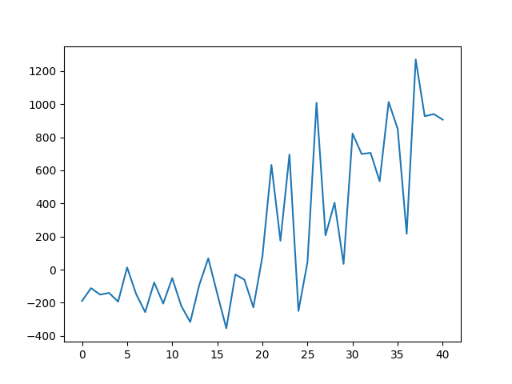

# Auto Hollow-Knight

>使用‘强化学习’知识训练模型操纵游戏‘空洞骑士’中的小骑士与BOSS战斗

**注意事项**：若要调试程序，请以管理员身份启动VSC

---

## 日志

### [万神殿-格鲁兹之母-调谐级] 2024-10-17

小骑士于2024/10/17晚的第30轮（合计约为60轮）训练左右偶尔能够击败BOSS，并于第40轮（合计约为70轮）训练左右能够经常性击败BOSS

虽然它学会的只是‘莽夫流’--“骄傲快劈，天下无敌”。
但需要考虑到程序的诸多限制与不足（后文会提到），再加上其奖励曲线确实有不小的进步，个人认为这个ai小骑士还是有在不断前进的。只是我的个人能力问题导致训练结果看起来不太聪明=_=

reward变化图（实际为30~70轮训练的reward）：

---

## 限制与不足

- 当前的代码并没有对小骑士做操作的多线程适配（相当于你在用一到两根手指头打游戏）
- 以我个人的程序效率与算力支持，程序的实际每秒接收帧数可能只有6~8帧
- 奖励机制的设置较为简单粗暴

---

## 参考资料

- [DQN只狼](https://github.com/analoganddigital/DQN_play_sekiro/blob/main/README.md): 蓝魔digital, DQN只狼实战教程, Github, 2021.
- [DQN只狼（Pytorch）](https://github.com/Skaiyin/DQN_play_blood):Skaiyin, torch form, Github, 2024.
